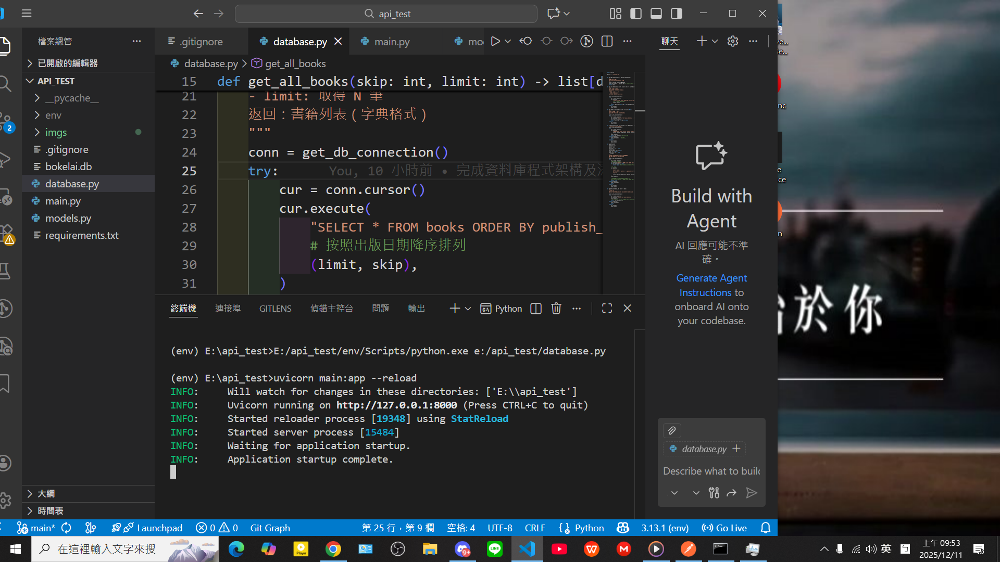
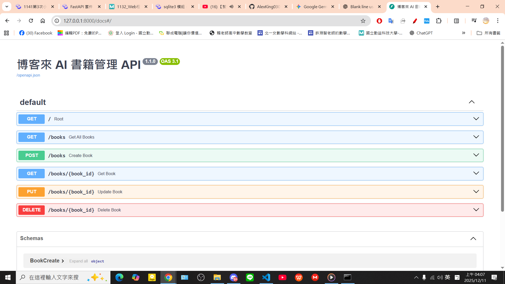
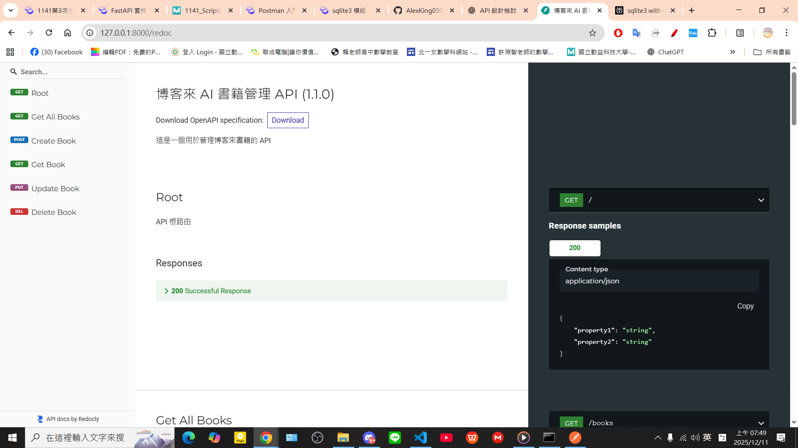
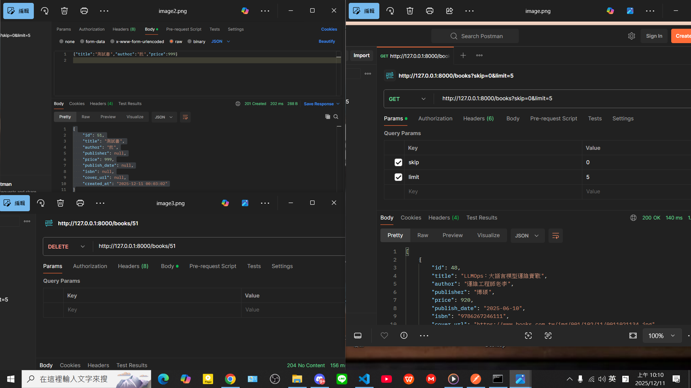

# 📚 博客來 AI 書籍管理 API (FastAPI)

> 基於 Python FastAPI 框架建立的 RESTful 服務，用於管理虛擬書籍資料庫。

## 啟動畫面


## Swagger UI（/docs）畫面


## ReDoc (/redoc) 畫面


## Postman 測試 GET /books、POST、DELETE 的成功截圖



## 📜 專案簡介

本專案實現了一個書籍資訊的 CRUD (Create, Read, Update, Delete) API，展示了如何利用 FastAPI 在高效能的環境中快速開發資料驅動的應用程式。API 具有嚴格的資料驗證、清晰的路由結構和自動生成的 API 文件。

- **API 標題**: 博客來 AI 書籍管理 API
- **API 描述**: 這是一個用於管理博客來書籍的 API
- **版本**: 1.1.0

---

## ✨ 主要特色

- **完整 CRUD 功能**：支援書籍資料的新增、查詢、更新與刪除
- **Pydantic 資料驗證**：使用 `BookCreate`、`BookResponse` 模型，確保輸入資料格式正確
- **分頁機制**：`GET /books` 支援 `skip` & `limit` 參數
- **參數型別與範圍驗證**：使用 FastAPI 的 `Query` 與 `Path`
- **一致的錯誤處理**：使用 `HTTPException` 管理 404 與 500
- **自動化 API 文件**：可透過 `/docs` 與 `/redoc` 互動操作 API

---

## 🛠️ 安裝與啟動

### 1. 安裝依賴套件

```bash
pip install -r requirements.txt
